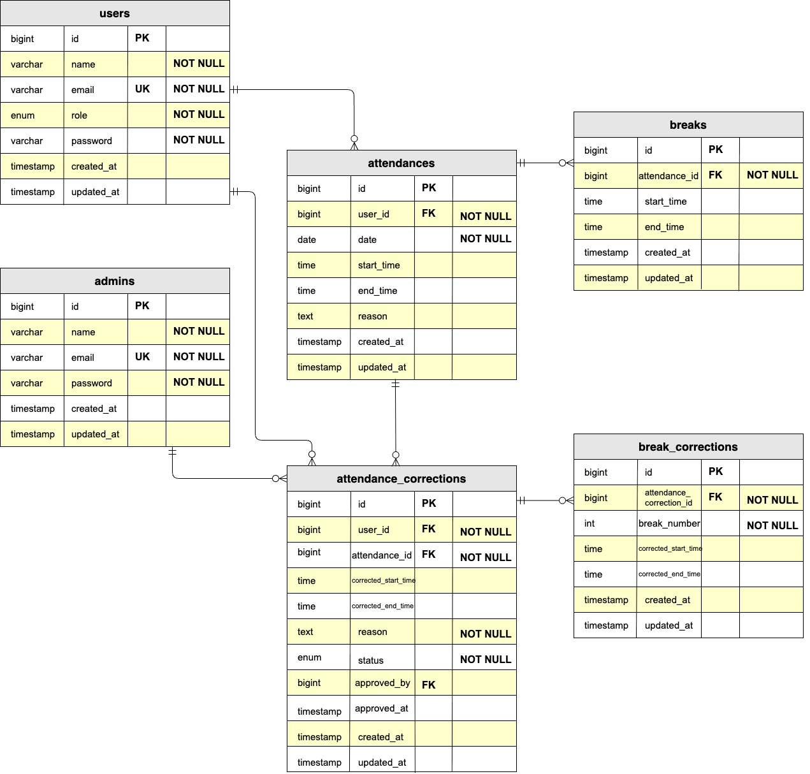

# COACHTECHフリマアプリ

こちらのアプリは、アイテムの出品と購入を行うためのフリマアプリです。

主な機能は以下の通りです。
* ユーザー登録 / ログイン機能（Laravel Fortify）
* メール認証機能（MailHog）
* 商品出品・購入機能
* Stripe を利用したカード決済機能
* コンビニ支払い

環境構築の詳細を以下に記載しております。

尚、Docker環境を使用しております。

## 環境構築

#### リポジトリをクローン

```

git clone git@github.com:ks-kanae/attendance-management.git

```

#### Dockerのビルド

```
cd flea-market_app

docker-compose up -d --build

```

#### Laravel パッケージのダウンロード

```
docker-compose exec php bash
(PHPコンテナ内へログイン)
```

```
composer install
(PHPコンテナ上で実行)
```

#### .env ファイルの作成

```
cp .env.example .env
(PHPコンテナ上で実行)
```

#### .env ファイルの修正

```
DB_CONNECTION=mysql
- DB_HOST=127.0.0.1
+ DB_HOST=mysql
DB_PORT=3306
- DB_DATABASE=laravel
- DB_USERNAME=root
- DB_PASSWORD=
+ DB_DATABASE=laravel_db
+ DB_USERNAME=laravel_user
+ DB_PASSWORD=laravel_pass
```
```
MAIL_MAILER=smtp
MAIL_HOST=mailhog
MAIL_PORT=1025
MAIL_USERNAME=null
MAIL_PASSWORD=null
MAIL_ENCRYPTION=null
- MAIL_FROM_ADDRESS=null
+ MAIL_FROM_ADDRESS=test@example.com
MAIL_FROM_NAME="${APP_NAME}"
```
```
(テスト用のStripe API キーを追加)
+ STRIPE_KEY=pk_test_XXXXXXXXXX
+ STRIPE_SECRET=sk_test_XXXXXXXXXX
```
#### キー生成

```
php artisan key:generate
(PHPコンテナ上で実行)
```

#### ストレージリンクの作成

```
php artisan storage:link
(PHPコンテナ上で実行)
```

#### マイグレーション・シーディングを実行

```
php artisan migrate
(PHPコンテナ上で実行)
```
```
php artisan db:seed
(PHPコンテナ上で実行)
```

#### テスト実行

```
php artisan test
(PHPコンテナ上で実行)
```

## 使用技術（実行環境）

フレームワーク：Laravel 8.75

言語：php 8.1.33

Webサーバー：Nginx 1.21.1

データベース：MySQL 8.0.36

## ER図



## URL

アプリケーション：http://localhost/

ユーザー登録：http://localhost/register

phpMyAdmin：http://localhost:8080/

MailHog管理画面 : http://localhost:8025/
  ※ 開発環境ではメール認証メールは MailHog に送信されます


## 作成されるテストユーザー

| 名前 | メールアドレス | パスワード |
|------|---------------|-----------|
| 山田太郎 | yamada@example.com | password |
| 佐藤花子 | sato@example.com | password |
| 田中一郎 | tanaka@example.com | password |
| 鈴木美咲 | suzuki@example.com | password |
| 高橋健太 | takahashi@example.com | password |

## 作成される管理者アカウント

メール: admin@example.com
パスワード: password
ログインURL: http://localhost/admin/login
